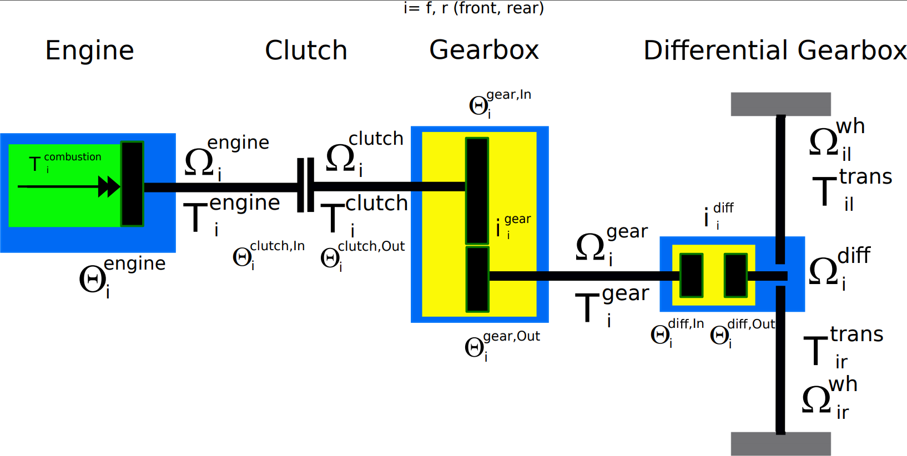

# Nonlinear Two Track Model Dynamic Horizontal Model (Part 2)

### 4.3 transmission

#### 4.3.2 Transmission at one axle

figure 4.4: Transmission at one axle

This transmission could be doubled for having a transmission at front
and/or rear.

The rotational speed is
(equation 4.29):

$$
\begin{split}
\Omega^{diff}_i &=\frac{1}{2}\cdot(\Omega_{il}^{wh}+\Omega_{ir}^{wh}) \\
\Omega^{gear}_i &=\Omega^{diff}_i\cdot i_i^{diff} \\
\Omega^{clutch}_i &=\Omega_i^{gear}\cdot i_i^{gear}\\
\Omega^{engine}_i &= 
\begin{cases}
\Omega_i^{clutch} & \alpha_i^{clutch} = 0 \\
\Omega_i^{clutch} \cdot (1-\alpha_i^{clutch}) + \Omega_i^{engine,idle} \cdot \alpha_i^{clutch} & 0 < \alpha_i^{clutch} < 1 \\
\Omega_i^{engine,idle} & \alpha_i^{clutch} = 1
\end{cases}\\
i=f,r
\end{split}
$$

It is assumed that in case of open clutch ($\alpha_i^{clutch} = 1$) a
idle speed is applied by engine control.

Engine torque could be written as:
(equation 4.30):

$$
\begin{split}
T^{comb}_i &=f(\Omega_i^{engine}, \alpha^{gas}) \\
T^{engine}_i &= T^{comb}_i - \Theta_i^{engine}\cdot \dot{\Omega}_i^{engine}\\
T^{clutch}_i &= (T^{engine}_i-\Theta_i^{clutch,In}\cdot\dot{\Omega}_i^{engine}) \cdot (1-\alpha_i^{clutch}) - \Theta_i^{clutch,Out}\cdot\dot{\Omega}_i^{clutch}\\
T^{gear}_i &= (T^{clutch}_i-\Theta_i^{gear,In}\cdot\dot{\Omega}_i^{clutch}) \cdot i^{gear}_i - d^{gear}_0  - d^{gear}_1\cdot\Omega_i^{gear}-\Theta_i^{gear,Out}\cdot\dot{\Omega}_i^{gear}\\
T^{diff}_{i} &= (T^{gear}_i-\Theta_i^{diff,In}\cdot\dot{\Omega}_i^{gear}) \cdot i_i^{diff} - \Theta_i^{diff,Out}\cdot\dot{\Omega}_i^{diff} \\
T^{trans}_{il} &= T^{trans}_{ir} =\frac{1}{2}\cdot T^{diff}_{i} 
\end{split}
$$

The differential output torque $T^{diff}_{i}$ is distributed to the
wheel torques $T^{trans}_{il}$ and $T^{trans}_{ir}$ by half. To bring
inertia to one equation we get
(equation 4.31):

$$
\begin{split}
\Theta_i^{total} &= \Theta_i^{diff,Out} +  (i^{diff}_i)^2\cdot\{ \Theta_i^{diff,In}+\Theta_i^{gear,Out}+(i^{gear}_i)^2\cdot \Theta_i^{sum} \}\\
\Theta_i^{sum} &=\Theta_i^{gear,In}+\Theta_i^{clutch,Out}+(1-\alpha_i^{clutch})\cdot(\Theta_i^{clutch,In}+\Theta_i^{engine})
\end{split}
$$

The rotational speed at the engine shaft could be described as:

(equation 4.32):

$$
\begin{split}
\Omega^{diff}_i &=\frac{1}{2}\cdot(\Omega_{il}^{wh}+\Omega_{ir}^{wh}) \\
\\
\Omega^{engine}_i &= 
\begin{cases}
\Omega_i^{diff}\cdot i_i^{diff}\cdot i_i^{gear} & \alpha_i^{clutch} = 0 \\
\Omega_i^{diff}\cdot i_i^{diff}\cdot i_i^{gear}\cdot (1-\alpha_i^{clutch}) + \Omega_i^{engine,idle} \cdot \alpha_i^{clutch} & 0 < \alpha_i^{clutch} < 1 \\
\Omega_i^{engine,idle} & \alpha_i^{clutch} = 1
\end{cases}
\end{split}
$$

With rotational speed $\Omega^{engine}_i$ and gas pedal ratio input
$\alpha^{gas}$ the torque at the wheels left and right could be written
for front and/or rear transmision as:
(equation 4.33):

$$
\begin{split}
T^{T}_i &= T^{comb}_i(\Omega_i^{engine}, \alpha^{gas}) \cdot (1-\alpha_i^{clutch}) \cdot  i^{gear}_i \cdot  i^{diff}_i\\
\\
T^{diff}_i &= T^{T}_i -  d^{gear}_0\cdot  i^{diff}_i  - d^{gear}_1\cdot  (i^{diff}_i)^2\cdot\Omega_i^{diff} - \Theta_i^{total}\cdot \dot{\Omega}_i^{diff}\\
\\
T^{trans}_{il} &= T^{trans}_{ir} =\frac{1}{2}\cdot T^{diff}_{i}\\
\\
i &= f,r
\end{split}
$$

Description of variables:

| input                                         | c code name         | unit      | comment                                                                                                |
| --------------------------------------------- | ------------------- | --------- | ------------------------------------------------------------------------------------------------------ |
|                                               | $i=f,r$             |           | front, rear                                                                                            |
| $\alpha^{gas}$                                | alpha_gas           | \-        | application of the gas (0\...1)                                                                        |
| $T^{comb}_i(\Omega_i^{engine}, \alpha^{gas})$ | T_combustion        | Nm        | combustion engine torque based on a function or table                                                  |
| $\alpha^{clutch}$                             | alpha_clutch        | \-        | application of the switchable clutch (0\...1) 0: clutch open; 1: clutch closed                         |
| $\Omega_{il}^{wh}$                            | omega_wh_il         | rad/s     | wheel speed left                                                                                       |
| $\Omega_{ir}^{wh}$                            | omega_wh_ir         | rad/s     | wheel speed right                                                                                      |
| $\dot{\Omega}_{il}^{wh}$                      | omega_dot_wh_il     | rad/s     | wheel acceleration left                                                                                |
| $\dot{\Omega}_{ir}^{wh}$                      | omega_dot_wh_ir     | rad/s     | wheel acceleration right                                                                               |
| output                                        |                     |           |                                                                                                        |
| $\Omega_i^{diff}$                             | omega_diff_in_i     | rad/s     | virtual differential input speed                                                                       |
| $\Omega_i^{engine}$                           | omega_engine_i      | rad/s     | engine speed                                                                                           |
| $T^{trans}_{ij}$                              | T_trans_ij          | Nm        | j=f,r transmission torque at wheel                                                                     |
| parameter                                     |                     |           |                                                                                                        |
| $i^{diff}_i$                                  | i_diff_i            | \-        | transformation ratio differential                                                                      |
| $i^{gear}_i$                                  | i_gear_i            | \-        | gear ratio of actual gear, for simplification assuming time linear transformation from old to new gear |
| $\Theta_i^{engine}$                           | theta_engine_i      | kg m\*\*2 | inertia engine                                                                                         |
| $\Theta_i^{clutch,In}$                        | theta_clutch_in_i   | m         | inertia clutch input side from engine seen                                                             |
| $\Theta_i^{clutch,Out}$                       | theta_clutch_out_i  | m         | inertia clutch output side from engine seen                                                            |
| $\Theta_i^{gear,In}$                          | theta_gear_in_i     | m         | inertia gear box input side from engine seen                                                           |
| $\Theta_i^{gear,Out}$                         | theta_gear_out_i    | m         | inertia gear box output side from engine seen                                                          |
| $\Theta_i^{diff,In}$                          | theta_diff_in_i     | m         | inertia differential gear box input side                                                               |
| $\Theta_i^{diff,Out}$                         | theta_diff_out_i    | m         | inertia differential gear box output side                                                              |
| $d_0^{gear}$                                  | d0_gear_i           | Nm        | constant friction gear box                                                                             |
| $d_1^{gear}$                                  | d1_gear_i           | Nm\*s/rad | damping factor gear box                                                                                |
| $\Omega_i^{engine,idle}$                      | omega_engine_idle_i | rad/s     | idle speed engine, while clutch is open                                                                |

#### derivation transmission

From (equation 4.33) it is:
(equation 4.34):

$$
\begin{split}
\frac{\partial T^{trans}_{il}}{\partial \Omega^{wh}_{il}} &= \frac{1}{2} \cdot \frac{\partial T^{diff}_{i}}{\partial \Omega^{diff}_{i}} \cdot \frac{\partial \Omega^{diff}_{i}}{\partial \Omega^{wh}_{il}}\\
\frac{\partial T^{trans}_{ir}}{\partial \Omega^{wh}_{ir}} &= \frac{1}{2} \cdot \frac{\partial T^{diff}_{i}}{\partial \Omega^{diff}_{i}} \cdot \frac{\partial \Omega^{diff}_{i}}{\partial \Omega^{wh}_{ir}}
\end{split}
$$

From (equation 4.29) we get
(equation 4.35):

$$
\begin{split}
\frac{\partial \Omega^{diff}_{i}}{\partial \Omega^{wh}_{il}} &= \frac{1}{2}\\
\frac{\partial \Omega^{diff}_{i}}{\partial \Omega^{wh}_{ir}} &= \frac{1}{2}
\end{split}
$$

From (equation 4.33) we get
(equation 4.36): 

$$
\begin{split}
\frac{\partial T^{diff}_{i}}{\partial \Omega^{diff}_{i}} &=  \frac{\partial T^{T}_i}{\partial \Omega^{diff}_{i}}  - d^{gear}_1\cdot  (i^{diff}_i)^2 - \Theta_i^{total}\cdot \frac{\partial \dot{\Omega}_i^{diff}}{\partial \Omega^{diff}_{i}}\\
\frac{\partial T^{T}_{i}}{\partial \Omega^{diff}_{i}} &= \frac{\partial T^{comb}_i(\Omega_i^{engine}, \alpha^{gas})}{\partial \Omega^{engine}_{i}} \cdot \frac{\partial \Omega_i^{emgine}}{\partial \Omega^{diff}_{i}}\cdot (1-\alpha_i^{clutch}) \cdot  i^{gear}_i \cdot  i^{diff}_i
\end{split}
$$

From (equation 4.29) we get for $\frac{\partial \Omega_i^{emgine}}{\partial \Omega^{diff}_{i}}$
(equation 4.37):

$$
\frac{\partial \Omega_i^{emgine}}{\partial \Omega^{diff}_{i}} = i_i^{diff}\cdot i_i^{gear}\cdot (1-\alpha_i^{clutch})
$$

If the clutch is open ($\alpha_i^{clutch}=1$) the factor is zero and for
closed clutch ($\alpha_i^{clutch}=0$) it is one.

The part $\Theta_i^{total}\cdot \frac{\partial \dot{\Omega}_i^{diff}}{\partial \Omega^{diff}_{i}}$
could be written as follows and it is an implicit part which has to be brought to the left side of the equation
(equation 4.38):

$$
\begin{split}
\Theta_i^{total}\cdot \frac{\partial \dot{\Omega}_i^{diff}}{\partial \Omega^{diff}_{i}} &= \Theta_i^{total}\cdot \frac{\partial \dot{\Omega}_{il}^{wh}}{\partial \Omega^{wh}_{il}}\\
\Theta_i^{total}\cdot \frac{\partial \dot{\Omega}_i^{diff}}{\partial \Omega^{diff}_{i}} &= \Theta_i^{total}\cdot \frac{\partial \dot{\Omega}_{ir}^{wh}}{\partial \Omega^{wh}_{ir}}
\end{split}
$$

For the jacobi matrix if we have to build $\frac{\partial \dot{\Omega}_{il}^{wh}}{\partial \Omega^{wh}_{il}}$ or
$\frac{\partial \dot{\Omega}_{ir}^{wh}}{\partial \Omega^{wh}_{ir}}$ the factor $\frac{1}{1+\frac{1}{4}\cdot\Theta_i^{total}}$ must be used on
the right side of the equation. The factor $\frac{1}{4}$ could be seen
in (equation 4.34)

The value $\frac{\partial T^{comb}_i(\Omega_i^{engine}, \alpha^{gas})}{\partial \Omega^{engine}_{i}}$
must be calculated or taken from the engine-characteristic table of engine torque

#### 4.3.3 engine combustion torque

Engine combustion torque could be easily parametrized by having a max
torque curve $T^{comb}_{max}=f(\Omega^{engine})$ for full gas pedal applied and minimum
characteristic for drag torque $T^{comb}_{min}=f(\Omega^{engine})$ for released gas pedal. 
The combustion torque is linear calculated between $\alpha=0$ and $\alpha=1$
(equation 4.39):

$$
\begin{split}
T^{comb}_{max} &= f_{max}(\Omega^{engine})  \hspace{1cm} \alpha^{gas}=1.0\\
T^{comb}_{min} &= f_{min}(\Omega^{engine})  \hspace{1cm} \alpha^{gas}=0.0\\
\\
T^{comb}       &=f(\Omega^{engine}, \alpha^{gas}) = T^{comb}_{min} + (T^{comb}_{max}-T^{comb}_{min}) \cdot \alpha_{gas}
\end{split}
$$

The derivation could be written as 
(equation 4.40):

$$
\begin{split}
        \frac{\Delta T^{comb}_{max}}{\Delta \Omega^{engine}} &= \frac{ f_{max}(\Omega_1^{engine})-f_{max}(\Omega_0^{engine})}{\Omega_1^{engine}-\Omega_0^{engine}}  \hspace{1cm} \alpha^{gas}=1.0\\
        \\
        \frac{\Delta T^{comb}_{min}}{\Delta \Omega^{engine}} &= \frac{ f_{min}(\Omega_1^{engine})-f_{min}(\Omega_0^{engine})}{\Omega_1^{engine}-\Omega_0^{engine}}  \hspace{1cm} \alpha^{gas}=0.0\\
        \\
        \frac{\partial T^{comb}}{\partial \Omega^{engine}}       &= \frac{\Delta T^{comb}_{min}}{\Delta \Omega^{engine}} + (\frac{\Delta T^{comb}_{max}}{\Delta \Omega^{engine}} - \frac{\Delta T^{comb}_{min}}{\Delta \Omega^{engine}}) \cdot \alpha_{gas}
    \end{split}

$$

Description of variables:

| input                   | c code name      | unit  | comment                             |
| ----------------------- | ---------------- | ----- | ----------------------------------- |
|                         | i=f,r            |       | front, rear                         |
| $T_{i,max}^{comustion}$ | T_max_comb_vec_i | Nm    | Vector of maximum combustion torque |
| $T_{i,min}^{comustion}$ | T_min_comb_vec_i | Nm    | Vector of minimum combustion torque |
| $\Omega_i^{comustion}$  | Omega_comb_vec_i | rad/s | Vector of combustion engine speed   |

### 4.4 brakes

The application of brake torque in an abstract way could be defined by a
protion from 0 ... 1 \alpha^{brake} to apply a brake torque between
zero and 1-g deceleration by dry surface.
(equation 4.41):

$$
\begin{split}
T^{brake,apply} &= \alpha^{brake} \cdot T^{brake,max}\\
T^{brake,max} &= (m + \frac{\sum_{ij=fl,fr,rl,rr} \Theta^{wh}_{ij}}{(R_{dyn})^2})\cdot g\cdot R_{dyn}
\end{split}
$$

The brake torque is distributed to front and rear with a const portion
from front axle (standard brake design) $f^{brake}_{FA}=const$ or as a
function of application (e.g. brake by wire)
$f^{brake}_{FA}=f(\alpha^{brake})$. To left and right the torque is usually half devided $p^{brake}_{leftright}=0.5$.
(equation 4.42):

$$
\begin{split}
T^{brake,apply}_{fl} &= T^{brake,apply}_{fr} = T^{brake,apply} \cdot f^{brake}_{FA} \cdot 0.5\\
T^{brake,apply}_{fr} &= T^{brake,apply}_{rr} = T^{brake,apply} \cdot (1.-f^{Bbrake}_{FA}) \cdot 0.5
\end{split}
$$

In 'Prof. Georg Rill: Simulation von Kraftfahrzeugen, Viehweg & Sohn,
1994' the model for efective brake torque is diveded into a static part
$T^{brake,stat}_{ij}$ and an additional dynamic part
$T^{brake,dyn}_{ij}$. The static part holds the wheel in equivalence
compared to transmission torque and tyre torque and is limited by the
application. $ij=fl,fr,rl,rr$ 
(equation 4.43):

$$
T^{brake,stat}_{ij} = min(T^{trans}_{ij} + T^y_{wh,ij},T^{brake,apply}_{ij})
$$

The additional dynamic part has a splope with a factor($d^{brake}_{ij}>>1$) to have a transition 
from static friction to dynamic friction for integration reasons according to wheel spinning.
The effective torque is limiteted to application torque.
(equation 4.44):

$$
\begin{split}
T^{brake,dyn}_{ij} &= d^{brake}_{ij}\cdot \Omega^{wh}_{ij}\\
T^{brake}_{ij} &= min(T^{brake,stat}_{ij} + T^{brake,dyn}_{ij},T^{brake,apply}_{ij})
\end{split}
$$

Description of variables:

| input                  | c code name     | unit  | comment                                      |
| ---------------------- | --------------- | ----- | -------------------------------------------- |
| $ij=fl,fr,rl,rr$       |                 |       |                                              |
| $\alpha^{brake}$       | alpha_brake     | \-    | application of the brake (0\...1)            |
| output                 |                 |       |                                              |
| $T^{brake,apply}$      | Tbrake_apply    | Nm    | applied total brake torque                   |
| $T^{brake,apply}_{ij}$ | Tbrake_apply_ij | Nm    | applied brake torque at wheel                |
| $T^{brake,stat}_{ij}$  | Tbrake_stat_ij  | Nm    | brake torque from static friction            |
| $T^{brake,dyn}_{ij}$   | Tbrake_dyn_ij   | Nm    | additional brake torque for dynamic friction |
| $T^{brake}_{ij}$       | Tbrake_ij       | Nm    | efective brake torque                        |
| parameter              |                 |       |                                              |
| $T^{brake,max}$        | Tbrake_max      | Nm    | maximum total torque                         |
| $g$                    | gravity         | m/s/s | gravity => 9.81                              |
| $f^{brake}_{FA}$       | fbrake_FA       | m     | Front Axle portion of torque distribution    |
| $d^{brake}_{ij}$       | dbrake_ij       | m     | slope for dynamic friction (d>\>1)           |

#### 4.4.1 derivation brakes

As long as $T^{brake,dyn}_{ij}$ from (equation 4.44) is acting
the derivation could be written as:

(equation 4.45):

$$
\frac{\partial T^{brake}_{ij}}{\partial \Omega^{wh}_{ij}} = 
\begin{cases}
d_{ij}^{brake} & T_{ij}^{brake,stat} + T_{ij}^{brake,dyn} < T_{ij}^{brake,apply}  \\
0 & T_{ij}^{brake,stat} + T_{ij}^{brake,dyn} \geq T_{ij}^{brake,apply}
\end{cases}

$$
