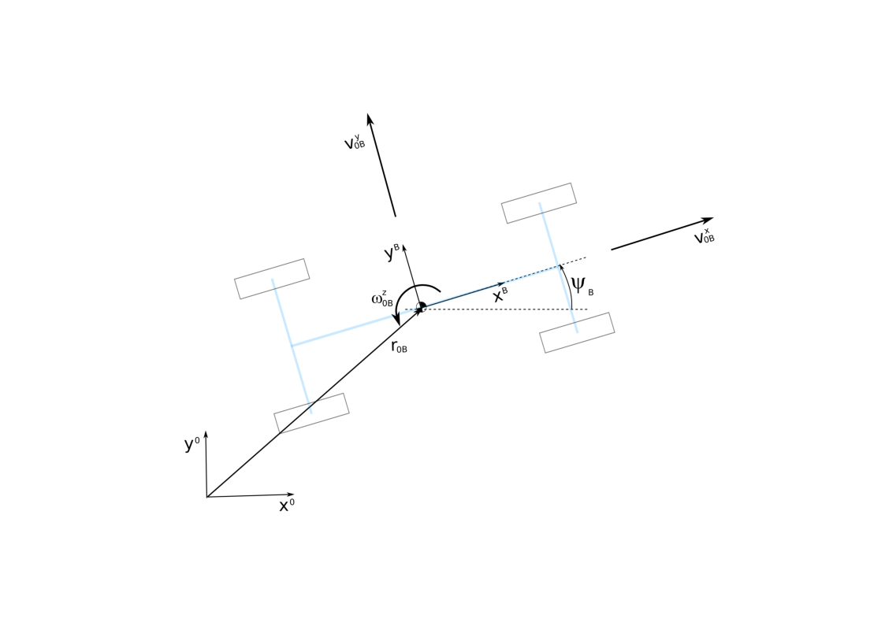

# Nonlienar Two Track Model

## Common

This horizontal model is based on "Anne von Vietinghoff, Nichtlineare
Regelung von Kraftfahrzeugen in querdynamisch kritischen
Fahrsituationen, 2008". It is a one mass model with three degrees of
freedom.

Additionally for calculating with a slip based approach for the tyres
also the spinning of a wheel with tyre is a degree of freedom. The
coordinate system of he vehicle is set to center of grafity (COG). Also
the tyre forces are dynamic equations.

The dynamic equations are based on Jourdain and D'Alembert ( Prof. Dr.
G. Rill und Prof. Dr.-Ing. Th. Schaeffer, Vorlesungsskript zur
Mehrkörperdynamik, Masterstudienganng Maschinenbau WS 2007/2008
Fachhochschule Regensburg). It represents the approach of the horizontal
model enlarged by spinning and tyre forces. With q holonomic constraints
and n parts of a system:

|                                      |                                                              |
| ------------------------------------ | ------------------------------------------------------------ |
| degree of freedom:                   | $f=6*n - q$                                                  |
| generalised independend coordinates: | $y = \begin{bmatrix}y_1 & y_2 & \dots & y_f \end{bmatrix}^T$ |
| position vector for each part:       | $r_{0k,0} = r_{0k,0}(y), k=1,2,\dots n$                      |
| with transfomation matrix:           | $A_{0k} = A_{0k}(y)$                                         |
| kinematic equation:                  | $\dot{y} = K(y) \cdot z$                                     |
| generalised velocities:              | $z = \begin{bmatrix}z_1 & z_2 & \dots & z_f \end{bmatrix}^T$ |
| velocity vector:                     | $v_{0k,0} = v_{0k,0}(y,z), k=1,2,\dots n$                    |
| rotational velocity vector:          | $\omega_{0k,k} = \omega_{0k,k}(y,z), k=1,2,\dots n$          |
|                                      |                                                              |

with nonholomic constraints it is:

| constraints    | example                                                          |
| -------------- | ---------------------------------------------------------------- |
| q holonomic    | in position   (z.B. Perle auf Draht)                             |
| p nonholonomic | in velocity   (e.g. Münze rollt  schlupffrei entlang einer Bahn) |

|                                             |                                                                  |
| ------------------------------------------- | ---------------------------------------------------------------- |
| degree of freedom holonomic & nonholonomic: | $f_v=6*n - q -p$                                                 |
| generalised velocities:                     | $z = \begin{bmatrix}z_1 & z_2 & \dots & z_{f_v} \end{bmatrix}^T$ |

## 2. Kinematic Equation

### 2.1 position vector in general

In general a position vector can be described as 
(equation 2.1):

$$
r_{0K,0} = r_{0B,0} + A_{0B} \cdot r_{BK,B}
$$

The position between inertia (0) and a certain point on the body (K) is the position vector
of the body frame $r_{0B,0} = \begin{bmatrix}x_{0B,0} & y_{0B,0}\end{bmatrix}^T$ plus the position vector between K and body(B) in body-coordinates $r_{BK,B}$ transformed in inertia coordinates by $A_{0B}$

### velocity description in general

The velocity of this vector: 
(equation 2.2):

$$
\begin{split}
    \frac{d}{dt}r_{0K,0} &= \dot{r}_{0K,0} =\frac{d}{dt}r_{0B,0} + \frac{d}{dt}(A_{0B} \cdot r_{BK,B})\\
    v_{0K,0} &= \dot{r}_{0B,0} + \dot{A}_{0B}\cdot r_{BK,B}  + A_{0B}\cdot \dot{r}_{BK,B}
\end{split}
$$

To get the derivation of $A_{0B}$ it is with $E=A^T_{0B} \cdot A_{0B}$:
(equation 2.3):

$$
\begin{split}
    \dot{A}_{0B}\cdot r_{BK,B} &= \dot{A}_{0B}\cdot (A^T_{0B} \cdot A_{0B}) \cdot r_{BK,B}\\
    &= \tilde{\omega}_{0B,0} \cdot r_{BK,0} = \omega_{0B,0} \times r_{BK,0}
\end{split}
$$

$\tilde{\omega}_{0B,0}$ is a skew symmetric matrix for the definition of
rotational speed (see below)\
So $v_{0K,0}$ can be described as: 
(equation 2.4):

$$
v_{0K,0} = v_{0B,0} + \omega_{0B,0} \times r_{BK,0}  + A_{0B}\cdot \dot{r}_{BK,B}
$$

If K is on body(B) constant $\dot{r}_{BK,B} = 0$

The rotation on a body can be described as 
(equation 2.5):

$$
\omega_{0K,0} = \omega_{0B,0} + A_{0B}\cdot \omega_{BK,B}
$$

$\omega_{BK,B}$ can be derived from: 
(equation 2.6):

$$
\tilde{\omega}_{BK,B} = \dot{A}_{BK}\cdot A^T_{BK} =
    \begin{bmatrix}
    0               & -\omega^z_{BK,B} & \omega^y_{BK,B} \\
    \omega^z_{BK,B} & 0                & -\omega^x_{BK,B} \\
    \omega^z_{BK,B} & \omega^x_{BK,B}  & 0 
    \end{bmatrix}
$$

$\tilde{\omega}_{BK,B}$ is a skew symmetric matrix for the definition of
rotational speed based the derivation of transformation matrix

A description in body or framework coordinates can be written as
(equation 2.7):

$$
\begin{split}
    v_{0K,B} &= v_{0B,B} + \omega_{0B,B} \times r_{BK,B}  + \dot{r}_{BK,B}\\
    \omega_{0K,B} &= \omega_{0B,B} + \omega_{BK,B}\\
\end{split}
$$

with

$$
\begin{split}
 v_{0B,B} &= A_{B0}\cdot v_{0B,0}\\
\omega_{0B,B} &= A_{B0}\cdot \omega_{0B,0}
\end{split}
$$

### 2.3 kinematic equation for horizontal model

figure 2.1  coordinate system inertia (0) and vehcile body (B)

Figure shows body of two track model and the coordinate systems
The horizontal model has one part, the body (B). The kinematic equations are 
(equation 2.8):

$$
\begin{split}
v^x_{0B,B} &= \dot{x}_{0B,0} \cdot \cos(\Psi_{0B,0}) + \dot{y}_{0B,0} \cdot \sin( \Psi_{0B,0} \\
v^y_{0B,B} &= -\dot{x}_{0B,0} \cdot \sin(\Psi_{0B,0}) + \dot{y}_{0B,0} \cdot \cos( \Psi_{0B,0} \\
\omega^z_{0B,B} &= \dot{\Psi}_{0B,0}
\end{split}
$$

The transformation matrix can be written as: 
(equation 2.9):

$$
A_{B0} = 
\begin{bmatrix}   
\cos(\Psi_{0B,0}) &  \sin(\Psi_{0B,0}) & 0 \\ 
-\sin(\Psi_{0B,0}) &  \cos(\Psi_{0B,0}) & 0 \\ 
0 & & 1
\end{bmatrix}
$$

The inertia based coordinates are 

(equation 2.10 - 2.12):

$$
y_F = 
\begin{bmatrix}  
 x_{0B,0} \\ y_{0B,0} \\ \Psi_{0B,0}
 \end{bmatrix}
$$

$$
z_F = 
\begin{bmatrix}  
 v^x_{0B,B} \\ v^y_{0B,B} \\ \omega^z_{0B,B}
 \end{bmatrix}
$$

$$
\begin{split}
 z_F &= A_{B0} \cdot \dot{y}_F\\
 \dot{y}_F &= A_{B0}^{-1} \cdot z_F\\
\end{split}
$$

The inversion of the transformation matrix is same as
transforming (orthogonal) 

(equation 2.13):

$$
A_{0B} = A_{B0}^{-1} = A_{B0}^{T}
$$

So we get the first differential equation for the kinematics

(equation 2.14):

$$
\begin{split}
 \dot{y}_F &= A_{0B} \cdot z_F\\
 A_{0B} &= 
\begin{bmatrix}  
 \cos(\Psi_{0B,0}) & -\sin(\Psi_{0B,0}) & 0 \\ 
\sin(\Psi_{0B,0}) & \cos(\Psi_{0B,0}) & 0 \\ 
0 & & 1
 \end{bmatrix}
\end{split}
$$

Description of variables:

| states            | c code name | unit  | comment                                                    |
| ----------------- | ----------- | ----- | ---------------------------------------------------------- |
| $y_F$             |             |       | kinematic horizontal vehcile displacment                   |
| $x_{0B,0}$        | x_0B0       | m     | x-distance inertia to Body (COG)                           |
| $y_{0B,0}$        | y_0B0       | m     | y-distance inertia to Body (COG)                           |
| $\Psi_{0B,0}$     | psi_0B0     | rad   | gear angle between inertia and Body frame (COG)            |
| $z_F$             |             |       | side slip angle in center of gravity                       |
| $v^x_{0B,B}$      | vx_0BB      | m/s   | x-direction velocity of vehicle in body coordination (COG) |
| $v^y_{0B,B}$      | vy_0BB      | m/s   | -direction velocity of vehicle in body coordination (COG)  |
| $\omega^z_{0B,B}$ | omegaz_0BB  | rad/s | turning speed in z-direction of vehicle (COG)              |
