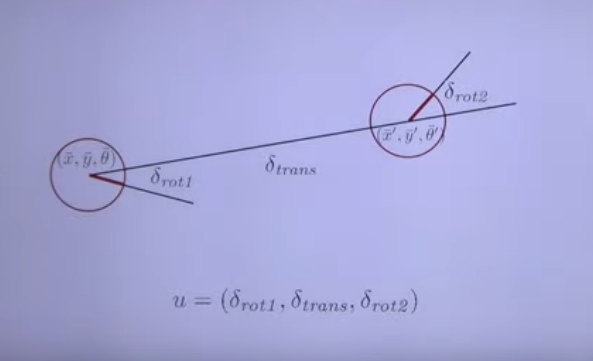
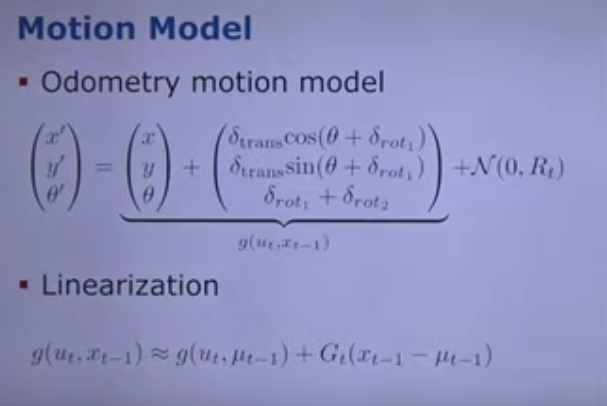
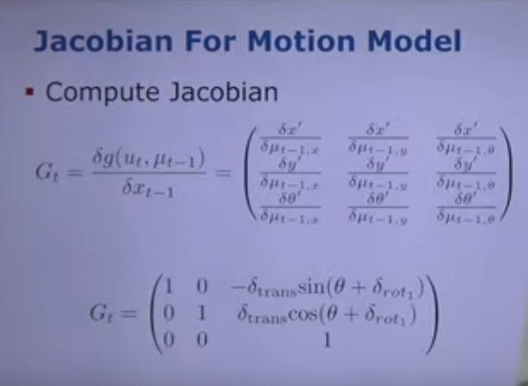
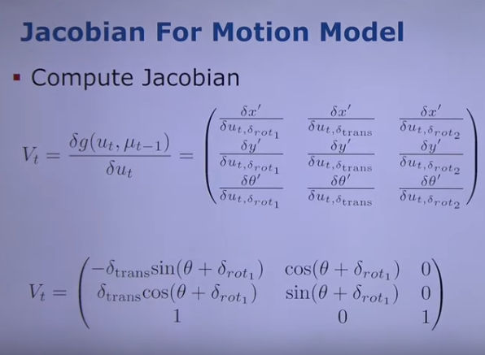
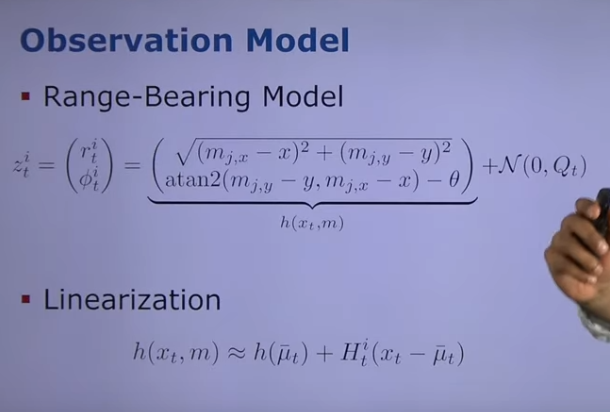
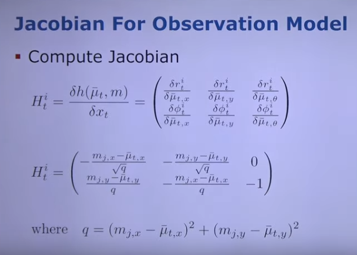
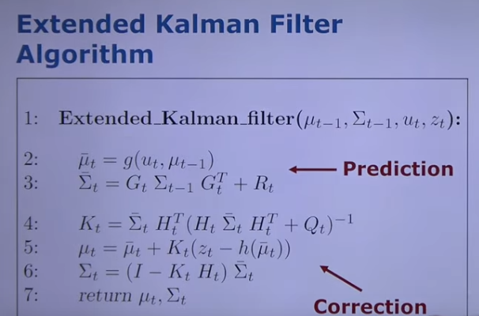
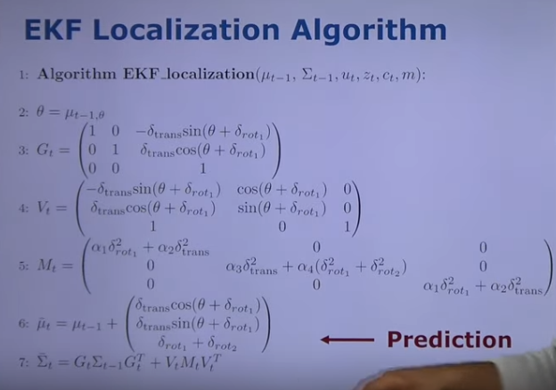
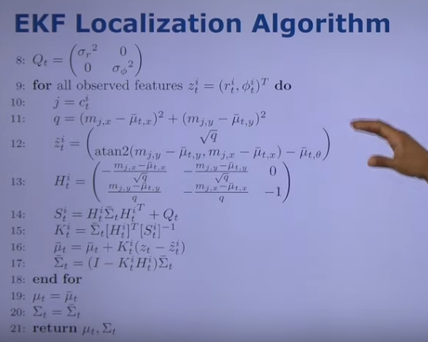

# Localisation mit EKF von Cyrill Stachniss and Nived Chebrolu

From Youtube

Prediction Model:

The Robot makes first the rotation $\delta_{rot1}$ then the translation $\delta_{trans}$ and then the second rotation $\delta_{rot2}$ 

odometry model for prediction
$$

$$

